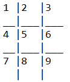

# Tic-Tax-Toe-Game
 This is an implemntation of a Tic-Tac-Toe game

## Installation
Clone the repository below:

'''bash
git clone https://github.com/Kems-Git/Tic-Tax-Toe-Game
'''

## How to Play:

1. User 1 chooses to be X or O

2. Select 1-9 to place your X or O

Here is an mapping of each number to each square on the board:

